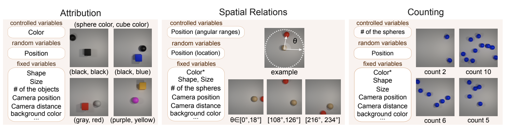

# MOSAIC: Multi-Object Spatial relations, AttrIbution, Counting

## Overview

MOSAIC is a controlled diagnostic framework for analyzing multi-object generation failures in text-to-image diffusion models. It isolates three compositional factors — **Color Attribution**, **Counting**, and **Spatial Relations** — enabling causal analysis of data effects.



## TODO

- [x] Default dataset generation code
- [ ] Grid dataset generation code
- [ ] Link for downloading pre-generated images

## Repository Layout

- `data_generation/generate_dataset.py`: main entry point for dataset generation
- `data_generation/dataset_generators.py`: task creation and execution
- `data_generation/utils.py`: Blender scene/object/render logic
- `generation_configs/xx.json`: default config
- `generate_dataset.sh`: example CPU/debug/GPU launcher


## Requirements

- Python 3.10.13 or later
- Download object assets from [COMFORT](https://github.com/sled-group/COMFORT/tree/main) repository
- Place object assets in `./mosaic/data_generation/assets`
- Place background blend files in `./mosaic/data_generation/background`
- Install Python dependencies: `pip install -r requirements.txt`

## How To Run

Generate datasets using the provided script:

```bash
bash generate_dataset.sh
```

Or run individual dataset generation commands:

**Counting Dataset**
```bash
python data_generation/generate_dataset.py --dataset_name generation_configs/count.json --save_path ./data --gpu
```

**Attribution Dataset**
```bash
python data_generation/generate_dataset.py --dataset_name generation_configs/attribution.json --save_path ./data --gpu
```

**Spatial Relations (Position Dataset)**
```bash
python data_generation/generate_dataset.py --dataset_name generation_configs/position.json --save_path ./data --gpu
```

**Spatial Relations with Distractors**
```bash
python data_generation/generate_dataset.py --dataset_name generation_configs/position_distractor.json --save_path ./data --gpu
```

Remove `--gpu` flag to run on CPU.


## Configuration

All dataset generation is controlled via JSON config files in `generation_configs/`:

- **num_images_per_class**: Number of images to generate per class
- **obj_shape**: Object shape (sphere, cube, cylinder)
- **obj_color**: Color(s) — can be a list `["red", "blue"]` or single value `"red"`
- **obj_size**: Size of the object (float, typically 0.5-2.0)
- **max_complexity**: Maximum object count (for counting and attribution) or distractor limit (for spatial relations)
- **cam_position**: Camera position (default: `[0, 0, 10]`)
- **obj2**: Second object properties (for attribution and spatial relations)
- **distractor**: Distractor object properties (for complex scenes)

## Output

- Output root is controlled by `--save_path`
- Generated data is saved under a dataset folder derived from config
- For counting, filenames encode color, index, and count class
- For attribution, images contain two object types with specific color labels
- For spatial relations, images contain two objects positioned within specified angle ranges

## Generated images

If you want to just download the dataset that has been already generated, please find it [here](https://nextcloud-rack.mai.informatik.tu-darmstadt.de/s/PAoH6BqDDLbDwyK).

## Notes

- **Multiprocessing**: In CPU mode (without `--debug`), generation uses multiprocessing for faster processing. Logs from multiple workers may interleave.
- **Debugging**: Use `--debug` flag for easier troubleshooting of object placement and count behavior.
- **Scene Bounds**: Objects are constrained to remain visible within camera frame (±4.0 range). Spatial relations use angle ranges to position obj2 relative to obj1.
- **Angle Ranges**: For position datasets, angle ranges (e.g., `[-45, 45]`) define the angular constraint from obj1 for obj2 placement (in degrees).
- **Collision Detection**: Objects are automatically checked for collisions and repositioned if needed.

## Acknowledgement

Most of the code is from the original [COMFORT](https://github.com/sled-group/COMFORT/tree/main) repository. We gratefully acknowledge their contribution. 

